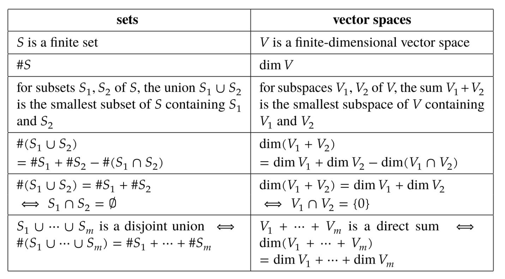

# Linear Algebra Done Right

## Chapter 2: Finite-Dimensional Vector Spaces

### 张成空间
$V$ 中向量组 $v_1,...,v_m$ 的所有线性组合所构成的集合称为 $v_1,...,v_m$ 的张成空间(span)，记作 $span(v_1,...,v_m)$ 。换言之， $span(v_1,...,v_m)=\lbrace a_1v_1+···+a_mv_m:a_1,...,a_m\in F\rbrace$ 。

定义空向量组 $()$ 的张成空间为 $\lbrace 0\rbrace$ 。

性质：向量组的张成空间是最小的包含组中所有向量的子空间。

### 张成
如果 $span(v_1,...,v_m)$ 等于 $V$ ，我们就说 $v_1,...,v_m$ 张成(spans) $V$ 。

### 多项式
对一个函数 $p:F\rightarrow F$ ，如果存在 $a_0,...,a_m\in F$ 使得对所有 $z\in F$ 都有

$$p(z)=a_0+a_1z+a_2z^2+···+a_mz^m$$

则称 $p$ 为系数在 $F$ 中的多项式(polynomial)。

$\mathcal{P}(F)$ 是系数在 $F$ 中的全体多项式所构成的集合。

注意 $\mathcal{P}(F)$ 是全体 $p(z)=a_0+a_1z+a_2z^2+···+a_mz^m$ 这种形式的函数构成的集合，且可以是无限维的。

对于一个多项式 $p\in \mathcal{P}(F)$ ，如果存在 $a_0,a_1,...,a_m\in F$ 且 $a_m\ne 0$ 使得对每个 $z\in F$ ，都有 

$$p(z)=a_0+a_1z+···+a_mz^m$$

那么就说 $p$ 的次数是 $m$ 。

规定恒等于 $0$ 的多项式的次数为 $-\infty$ 。

多项式 $p$ 的次数记为 $deg~p$ 。

对于非负整数 $m$ ， $\mathcal{P}_m(F)$ 表示系数在 $F$ 中且次数不高于 $m$ 的所有多项式所构成的集合。

即若 $m$ 是非负整数，那么 $\mathcal{P}_m(F)=span(1,z,...,z^m)$ 。

### 线性无关
对于 $V$ 中的一个向量组 $v_1,...,v_m$ ，如果使得

$$a_1v_1+···+a_mv_m=0$$

成立的 $a_1,...,a_m\in F$ 的唯一选取方式是 $a_1=···=a_m=0$ ，那么称该向量组为线性无关(linearly independent)的。

规定空向量组 $()$ 也是线性无关的。

### 线性相关
如果 $V$ 中的一个向量组不是线性无关的，就称它是线性相关(linearly dependent)的。

换言之，对于 $V$ 中的向量组 $v_1,...,v_m$ ，如果存在不全为 $0$ 的 $a_1,...,a_m\in F$ 使得 $a_1v_1+···+a_mv_m=0$ ，那么该向量组是线性相关的。

### 线性相关引理
设 $v_1,...,v_m$ 是 $V$ 中的一个线性相关组，那么存在 $k\in \lbrace 1,2,...,m\rbrace$ 满足 $v_k\in span(v_1,...,v_{k-1})$ ，即 $v_k$ 可用 $v_1,...,v_{k-1}$ 线性表示。

### 线性无关组的长度
在有限维向量空间中，每个线性无关向量组的长度小于或等于每个张成向量组的长度。

即，假设 $u_1,...,u_m$ 是 $V$ 中的线性无关组，并假设 $w_1,...,w_n$ 张成 $V$ ，有 $m\le n$ 成立。

### 基（basis）
向量空间 $V$ 的基是 $V$ 中的一个向量列表，满足其线性无关且能张成向量空间 $V$ 。

### 基的判定
一个向量列表 $v_1,...,v_n$ 是向量空间 $V$ 的基当且仅当每一个 $v\in V$ 可以唯一地写成 $v=a_1v_1+...+a_nv_n$ 的形式，其中 $a_1,...,a_n\in F$。

### $V$ 的每个子空间都是等于 $V$ 的直和的一部分
假设 $V$ 是有限维的，且 $U$ 是 $V$ 的一个子空间。那么存在 $V$ 的一个子空间 $W$ ，使得 $V=U\oplus W$ 。

### 维度
有限维线性空间的维度是该向量空间任意一组基的长度，记作 $dim V$ 。

### 判定基的方法
假设 $V$ 是有限维的，则 $V$ 中每一个长度为 $dimV$ 的生成向量列表都是 $V$ 的一组基。

### 和空间的维度
如果 $V_1$ 和 $V_2$ 是一个有限维空间的子空间，则

$$dim(V_1+V_2)=dimV_1+dimV_2-dim(V_1\cap V_2)$$

### 集合与向量空间
